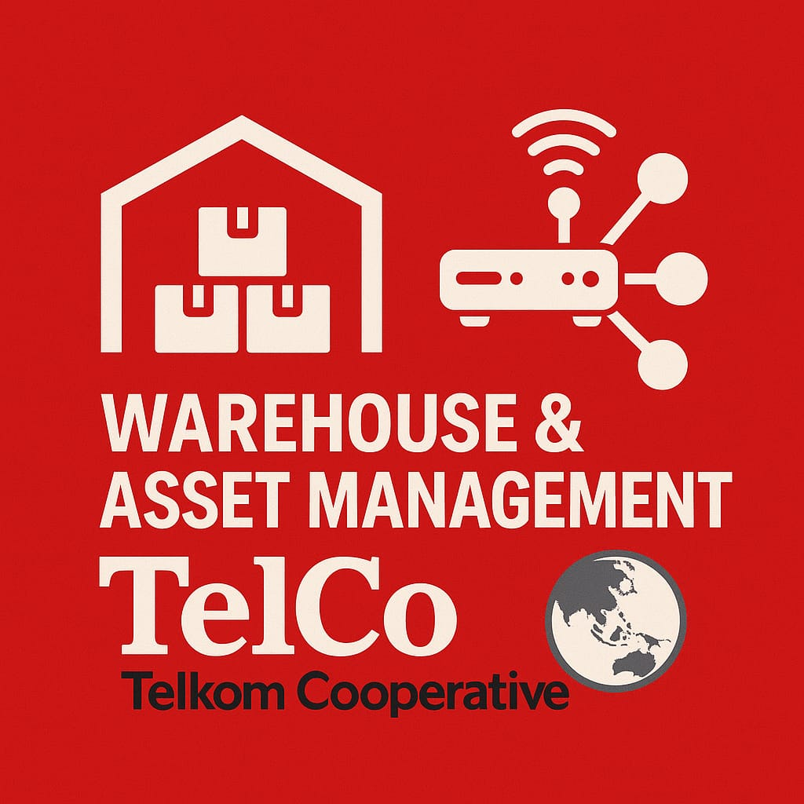
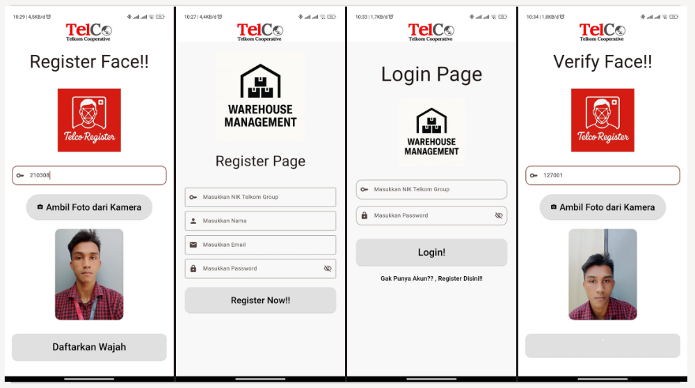
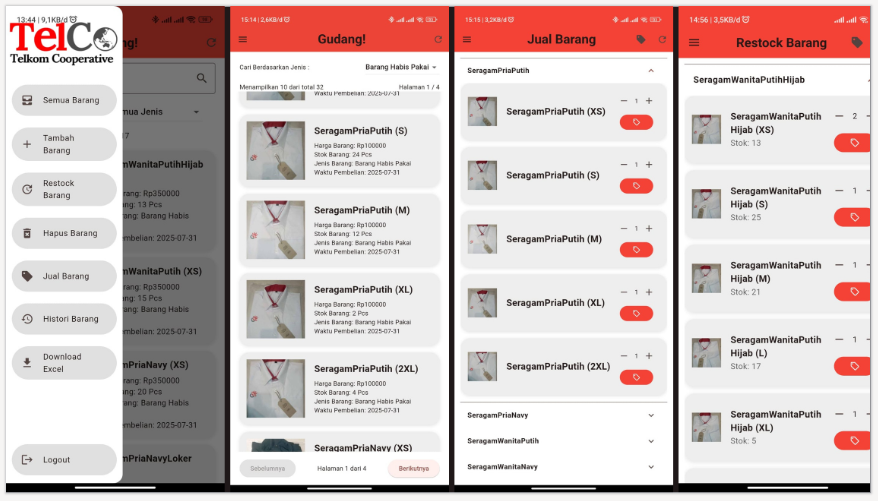
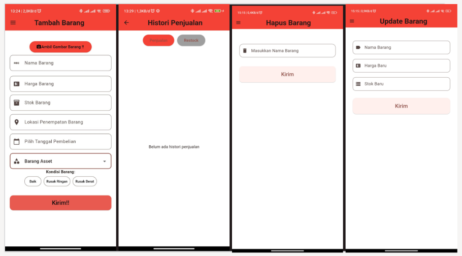
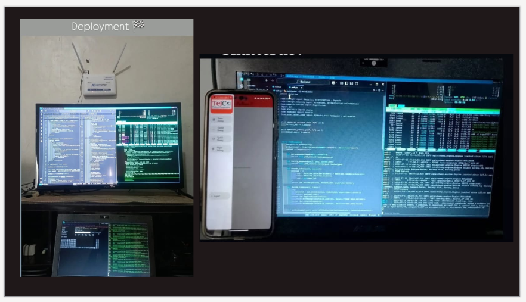

<!-- Warning :: Using CTRL + SHIFT + V For View README.md In Visual Studio Code :: Warning-->

<h1 align="center">Warehouse & Asset Management Application</h1>
<h3 align="center">PT Koperasi Telekomunikasi Indonesia</h3>

 

<h2 align="center"><Strong> Tech-Stack : </Strong></h2>
<ul>
    <li>FastAPI-Python (BACKEND)</li>
    <li>OpenCV-Python</li>
    <li>Flutter-Dart (FRONTEND)</li>
    <li>PostgreSQL (DATABASES)</li>
    <li>SQLModel (ORM)</li>
    <li>Argon2 (Password Hashing)</li>
    <li>PyJWT + ES256 Algorythm</li>
    <li>Alembic Migration</li>
    <li>Uvicorn ASGI Server</li>
</ul>

 

<h2 align="center"><Strong> Features : </Strong></h2>
<ul>
    <li>UI & UX</li>
    <Strong> => Memiliki Tampilan UI yang sederhana dan responsive sehingga nyaman dan mudah digunakan</Strong>
    <li>Face ID Verification</li>
    <Strong> => Memiliki fitur face recognition . Menggunakan teknologi computer vision dari OpenCV yang dapat mengindentifikasi dan melakukan verifikasi struktur wajah dengan cepat dan akurat</Strong>
    <li>Security And Authentication</li>
    <Strong> => Memiliki tingkat keamanan yang tinggi , Meminimalisir terjadinya serangan siber . Menggunakan Argon2 untuk hashing password dan jwt token dengan algoritma ES256</Strong>
    <li>Data Security</li>
    <Strong> => menggunakan database postgreSQL dan ORM SQLmodel , Mengurangi resiko serangan SQLInjection . Dan menggunakan uuid4 Untuk Membuat Unique ID</Strong>
    <li>Server Friendly</li>
    <Strong> => Menggunakan FastAPI sebagai backend dan server uvicorn + gunicorn yang menghasilkan performa backend yang sangat tinggi namun tidak membebani server</Strong>
    <li>Excel Report</li>
    <Strong> => Memiliki fitur excel report . Membuat laporan excel dengan cepat menggunakan teknologi openpyxl . Menghasilkan laporan excel yang dapat di download oleh user</Strong>
    <li>QR Code Generator & Scanner</li>
    <Strong> => Memiliki fitur QR code generator . Memungkinkan user untuk scan kode QR . Menghasilkan informasi detail dari item tersebut</Strong>
</ul>
 

<h2 align="center"><Strong> Application View : </Strong></h2>

<h2 align="center"><Strong> Development : </Strong></h2>

## © 2025 Rivaldi Fadlan

All rights reserved. Unauthorized use, copying, modification, or distribution without permission is strictly prohibited.
